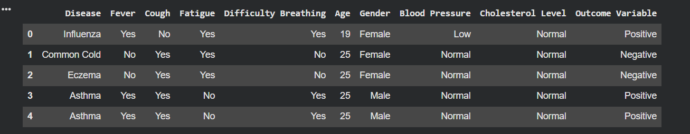
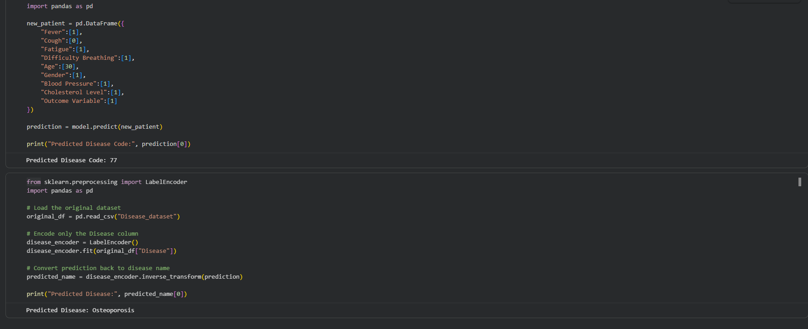
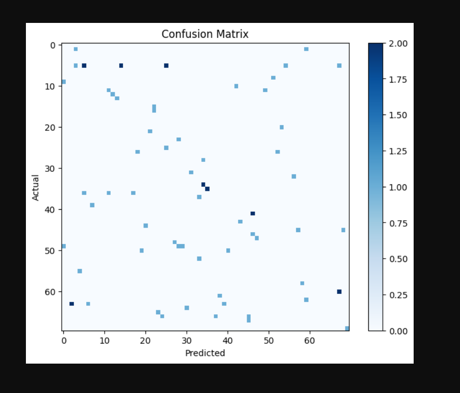

# Disease Prediction Using Machine Learning
## Model Performance

- Algorithm: Decision Tree Classifier
- Train-Test Split: 80:20
- Accuracy: 24.29

## Project Overview

This project predicts diseases based on patient symptoms using a Decision Tree Classifier.

The model is trained on patient symptom data and can predict the most likely disease based on user inputs.

---
---

# Project Screenshots

## Dataset Preview



## Prediction Output



## Confusion Matrix



---

## Features

- Data Preprocessing
- Exploratory Data Analysis (EDA)
- Feature Encoding
- Decision Tree Classification
- Disease Prediction
- Model Evaluation

---

## Technologies Used

- Python
- Pandas
- NumPy
- Matplotlib
- Scikit-learn
- Google Colab

---

## Dataset

The dataset contains patient information including:

- Disease
- Fever
- Cough
- Fatigue
- Difficulty Breathing
- Age
- Gender
- Blood Pressure
- Cholesterol Level
- Outcome Variable

---

## Machine Learning Model

- Decision Tree Classifier

---

## Project Structure

```
Disease-Prediction-Using-ML
│
├── Disease_Prediction.ipynb
├── Disease_dataset.csv
└── README.md
```

---

## Future Improvements

- Random Forest
- XGBoost
- Streamlit Web App
- Model Deployment

---

## Author

**Sai Siddhartha Goud**

B.Tech CSE | Data Science Enthusiast
